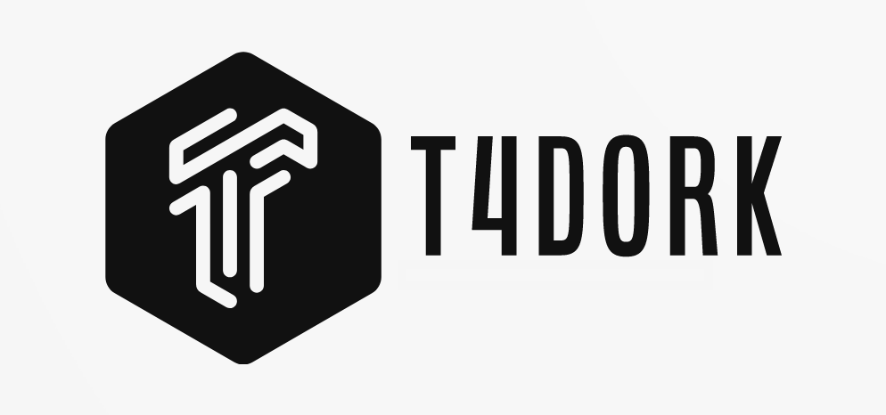

# For Turkish version of README, [click here](README.tr.md).

"# 🚀 t4dork: Information Gathering Tool with Google Dorks!



t4dork is the fastest way to dive into the depths of the internet! It is a pentesting tool that performs information gathering on target websites using Google dorks. With the potential to expose sensitive information, this tool offers an effective method for ensuring information security and identifying weak points in defenses.

## 🌟 Features

- 🎯 Automatically applies more than 100 Google dorks.
- 🌐 Comprehensive information gathering on the target site.
- 📝 Provides results in an easily readable and well-organized format.
- 👨‍💻 User-friendly and simple command line interface.

## 💻 Installation

The installation of T4Dork is quite simple. Just follow the steps below:

```
git clone [https://github.com/tunahantekeoglu/t4dork.git]
cd t4dork
pip3 install -r requirements.txt
```

## 🎮 Usage

It is very simple to use. Just run the application by specifying the target site:

```
python3 t4dork.py -u target.com
```

## 📄 License

This tool is published under the MIT License. Please see the [LICENSE](LICENSE) file for details.

## ⚠️ Disclaimer

T4Dork is designed for legal and ethical penetration testing. Unauthorized use is illegal and the user is fully responsible for such actions.

## 👥 Contributing

If you want to make improvements to this tool, please send a 'Pull Request' or add issues to the 'Issues' section. This tool thrives with the support of the community!

Of course, below is a new design where you can make the addition you want:

---

<div align="center">

## Get in touch with me! 🚀

[](https://www.instagram.com/tunahantekeoglu)<br>
[](https://twitter.com/tunahantekeoglu)<br>
[](https://www.linkedin.com/in/tunahantekeoglu/?originalSubdomain=tr)<br>

### Or You Can Send Me an Email 📩

[](mailto:tunahantekeoglu@gmail.com)

## To Read My Articles About Cyber Security

[](https://medium.com/@tun4hunt)

</div>

---

