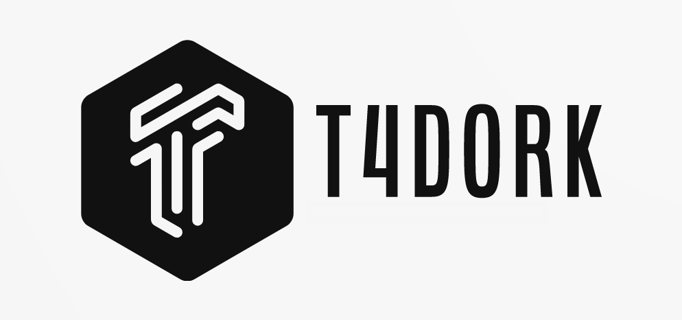

# 🚀 t4dork: Google Dorkları İle Bilgi Toplama Aracı!



t4dork, internetin derinliklerine dalmanın en hızlı yoludur! Google dorklarını kullanarak hedef siteler üzerinde bilgi toplama işlemi gerçekleştiren bir pentesting aracıdır. Hassas bilgileri açığa çıkarma potansiyeline sahip olan bu araç, bilgi güvenliğini sağlamak ve savunmaların zayıf noktalarını belirlemek için etkili bir yöntem sunar.

## 🌟 Özellikler

- 🎯 100'den fazla Google dork'unu otomatik olarak uygular.
- 🌐 Hedef site üzerinde kapsamlı bilgi toplama.
- 📝 Sonuçları kolay okunabilir ve düzenlenmiş bir biçimde çıktı olarak verir.
- 👨‍💻 Kullanıcı dostu ve basit bir komut satırı arayüzü.

## 💻 Kurulum

T4Dork'un kurulumu oldukça basittir. Sadece aşağıdaki adımları izleyin:

```
git clone [https://github.com/tunahantekeoglu/t4dork.git]
cd t4dork
pip3 install -r requirements.txt
```

## 🎮 Kullanım

Kullanımı oldukça basittir. Sadece hedef siteyi belirterek uygulamayı çalıştırın:

```
python3 t4dork.py -u target.com
```

## 📄 Lisans

Bu araç, MIT Lisansı altında yayınlanmıştır. Lütfen detaylar için [LICENSE](LICENSE) dosyasına bakınız.

## ⚠️ Sorumluluk Reddi

T4Dork, yasal ve etik penetrasyon testleri için tasarlanmıştır. İzinsiz kullanımı yasadışıdır ve bu tür eylemlerden kullanıcı tamamen sorumludur.

## 👥 Katkıda Bulunma

Bu araç üzerinde iyileştirmeler yapmak isterseniz, lütfen bir 'Pull Request' gönderin veya sorunları 'Issues' kısmına ekleyin. Bu araç topluluğun desteğiyle gelişir!

Elbette, aşağıda istediğiniz eklemeyi yapmış şekilde yeni bir tasarım bulunmaktadır:

---

<div align="center">

## Benimle iletişime geçin! 🚀

[](https://www.instagram.com/tunahantekeoglu)<br>
[](https://twitter.com/tunahantekeoglu)<br>
[](https://www.linkedin.com/in/tunahantekeoglu/?originalSubdomain=tr)<br>

### Ya da Bana Mail Gönderebilirsiniz 📩

[](mailto:tunahantekeoglu@gmail.com)

## Siber Güvenlik Hakkındaki Yazılarımı Okumak İçin

[](https://medium.com/@tun4hunt)

</div>

---
